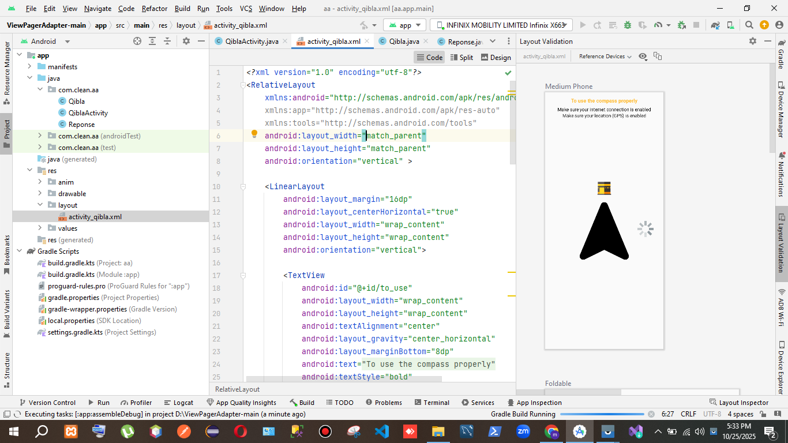
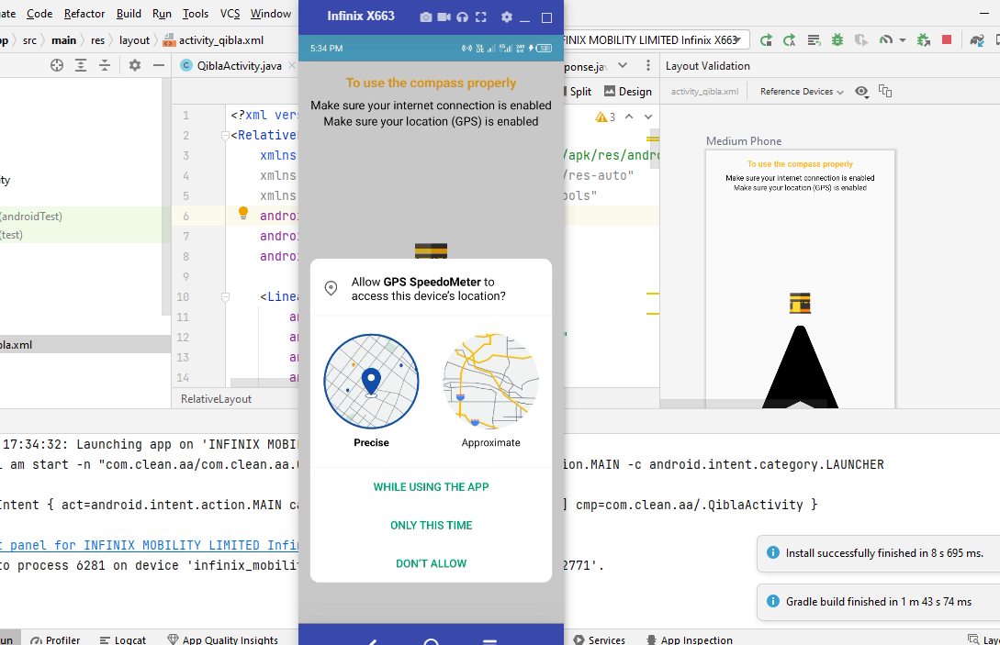

Here’s a clear 3-line explanation of every important function in your QiblaActivity class:

🧠 onCreate(Bundle savedInstanceState)

Initializes the Qibla Compass screen, sets Arabic locale, and inflates activity_qibla.xml.
Requests location permission via Dexter and configures location + sensor managers.
Fetches last known location and starts compass rotation updates if GPS is enabled.

⚙️ onDestroy()

Called when the activity is destroyed.
Unregisters the sensor listener to free resources and prevent leaks.
Ensures no further sensor callbacks occur after activity exit.

🧭 onSensorChanged(SensorEvent sensorEvent)

Triggered when the device orientation changes.
Calculates rotation and animates the compass to align toward the Qibla direction.
Changes compass color when device faces approximately the Qibla.

⚙️ onAccuracyChanged(Sensor sensor, int accuracy)

System callback for sensor accuracy changes.
Not implemented here (empty body).
Could be used for fine-tuning sensor response.

🌍 GitHubService (Interface)

Retrofit interface for the Aladhan API endpoint.
Defines a GET request to /qibla/{latitude}/{longitude} returning a Reponse object.
Used to fetch the correct Qibla direction for given coordinates.

📡 onLocationChanged(Location location)

Called when a new GPS/network location is received.
Fetches current latitude and longitude and sends them to the API via Retrofit.
Updates qiblaDegree based on API response for accurate compass orientation.

⚠️ onStatusChanged(String provider, int status, Bundle extras)

Deprecated location callback for provider status changes.
Not used — included only for interface compliance.
Can track GPS/network availability changes.

✅ onProviderEnabled(String provider)

Triggered when the user enables GPS/location service.
Can be used to restart location updates.
Empty here but could notify user or reload compass.

🚫 onProviderDisabled(String provider)

Called when GPS/location service is turned off.
Could alert the user to enable GPS.
Empty here — but the Toast in onCreate already covers it.

